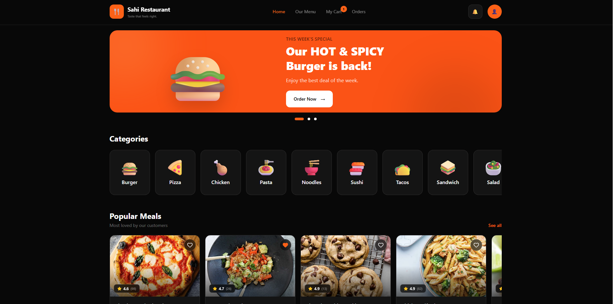
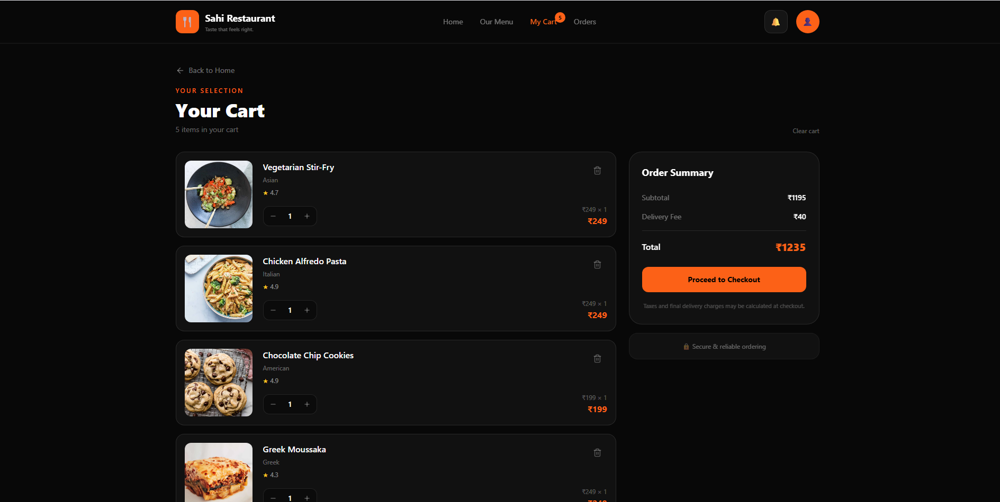

# SAHI RESTAURANT 

A full-featured food ordering and recipe exploration web app — browse recipes by category, dig into details, add dishes to your cart, place orders, and keep a list of favorites. Think of it as a small-scale food delivery experience, built from scratch to understand how real-world React applications are structured.


##  Screenshots

### Home


### Recipe Details


### Cart



# 🍽️ Sahi Restaurant

> A modern food ordering and recipe exploration web application built with React.

[🌐 Live Demo](https://sahi-restaurant.vercel.app/) · [📦 GitHub Repository](https://github.com/krishnacodes17/Sahi_Restaurant)


##  What It Does

- **Authentication** — Login and Register flows with form validation, session persistence, and protected routes so unauthenticated users never see the app's private pages.
- **Recipe Explorer** — Browse recipes by category, search, and paginate through results. Every recipe has a detail page.
- **Cart & Checkout** — Add dishes to a cart with live total calculations, then place orders in one click.
- **Order History** — All placed orders are tracked and viewable anytime.
- **Favorites** — Save dishes you love with a single toggle.
- **User Profile** — View account details after logging in.
- **Static Pages** — About, Contact, Terms, and Privacy pages, all lazy-loaded like everything else.

Everything survives a page refresh — cart, favorites, orders, and auth state are all persisted to `localStorage` and re-hydrated on load.

---

##  Tech Stack (and Why)

| Technology | Why I chose it |
|---|---|
| React 19 + Vite 7 | Fast development and modern frontend tooling |
| Redux Toolkit | Global state management for auth, cart, favorites and orders |
| TanStack Query v5 | Server-state management, caching and API loading states |
| React Router v7 | Nested routing, protected routes and lazy-loaded pages |
| Tailwind CSS v4 | Consistent responsive UI development |
| Axios | Centralized HTTP client for DummyJSON API |
| React Hook Form | Efficient form handling and validation |

---

##  Architecture

I deliberately structured this as a **feature-sliced application** instead of dumping everything into `components/` and `pages/`. Each feature owns its own state, hooks, and UI:

```
src/
├── app/
│   ├── layouts/          # AuthLayout, HomeLayout (app shells)
│   └── store/            # Redux store configuration
├── config/               # Axios instance / API base setup
├── features/
│   ├── auth/             # Login, Register, session hydration
│   ├── cart/             # Cart slice + checkout logic
│   ├── favorites/        # Favorites slice
│   ├── orders/           # Order placement + history
│   ├── profile/          # User details
│   └── recipes/          # Recipes API, hooks, pages, shared UI
├── routes/
│   └── AppRoutes.jsx     # Single source of truth for routing
└── shared/
    ├── hook/             # Reusable utilities
    └── ui/               # ErrorBoundary, loaders, static pages
```

### Engineering Decisions I'm Proud Of

- **Code splitting everywhere** — every route is lazy-loaded via `React.lazy` + `Suspense`, so the initial bundle stays small and each page loads on demand.
- **Route-level protection** — dedicated guard components redirect users based on auth state before any protected content renders.
- **Graceful failure** — React Error Boundaries wrap page content, so one broken component doesn't nuke the whole app.
- **State rehydration pattern** — an async thunk restores the user session from localStorage on app start, keeping Redux as the single source of truth.
- **Custom hooks per feature** — components stay presentational; data-fetching and business logic live in reusable hooks (`useAllRecipesHook`, `useStoreHook`, etc.).

---

##  Getting Started

```bash
# Clone the repo
git clone <repo-url>
cd sahiHotel

# Install dependencies
npm install

# Start the dev server
npm run dev
```

Then open [http://localhost:5173](http://localhost:5173).

### Available Scripts

| Command | Description |
|---|---|
| `npm run dev` | Start development server |
| `npm run build` | Production build |
| `npm run preview` | Preview the production build locally |
| `npm run lint` | Run ESLint across the project |

---

##  Roadmap

- [ ] Real backend integration (replace DummyJSON)
- [ ] Payment flow simulation
- [ ] Unit tests with Vitest + React Testing Library
- [ ] Dark/light theme toggle

---

##  What This Project Taught Me

Building this taught me how the pieces of a real app fit together — designing Redux slices around features rather than pages, handling async flows with thunks, structuring routers with nested layouts and guards, and thinking about what happens when things fail (error boundaries, loading states, empty carts). It's the project I point to when someone asks if I can do more than follow tutorials.

---


